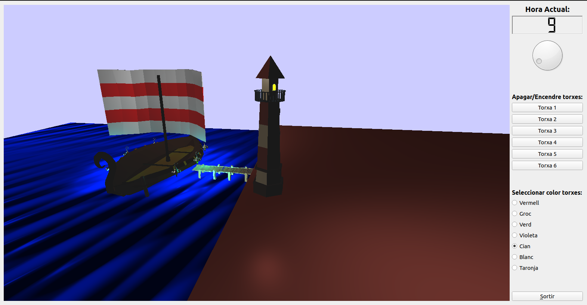

# Proyecto OpenGL y Qt: Movimiento de Objetos y Control de la Iluminación

Este proyecto es una aplicación gráfica desarrollada con **OpenGL** y **Qt** que simula el movimiento de un barco en un entorno 3D. Incluye control de iluminación en la escena y una interfaz gráfica de usuario (UI) para manipular tanto el barco como las luces. La aplicación está diseñada para ser educativa y se enfoca en los conceptos básicos de programación gráfica, interacción 3D y uso de la biblioteca Qt para construir interfaces gráficas.




## Tabla de Contenidos

- [Características](#características)
- [Instalación](#instalación)
- [Uso](#uso)

## Características

- **Simulación de movimiento de un barco**: Control básico del movimiento del barco en un plano 3D utilizando las teclas de dirección y controles de la UI.
- **Iluminación dinámica**: Programación de luces de escena utilizando OpenGL para crear efectos de iluminación realistas en el entorno.
- **Interfaz de usuario con Qt**: Controles en la UI para ajustar la posición y la orientación del barco y para modificar parámetros de iluminación como intensidad, color y posición.
- **Diseño modular**: Arquitectura de código que separa la lógica de movimiento, iluminación y UI, facilitando la expansión y el mantenimiento del código.

## Instalación

1. **Clona el repositorio**:
    ```bash
    git clone https://github.com/Markuus9/Luces-OpenGL.git
    cd Luces-OpenGL
    ```

2. **Instala las dependencias** (si estás usando una distribución basada en Debian/Ubuntu):
    ```bash
    sudo apt update
    sudo apt install build-essential qt5-default qtbase5-dev libgl1-mesa-dev
    ```

3. **Compila el proyecto**:
    - Abre el proyecto en **Qt Creator** (se recomienda la versión 5.12 o superior).
    - Configura el kit de compilación adecuado y compila el proyecto.

## Uso

1. Ejecuta la aplicación desde la terminal:
    ```bash
    #compile the code
    make
    #run the program
    ./activitat3
    ```

2. **Controles de la UI**:
    - **Movimiento del Barco**: Utiliza las teclas W/S para la dirección del barco, A/D para el control del faro, y las flechas ↑/↓ para el control de la hora.
    - **Control de Luces**: Ajusta la intensidad, el color y la posición de la fuente de luz principal a través de los sliders y selectores en la UI.

